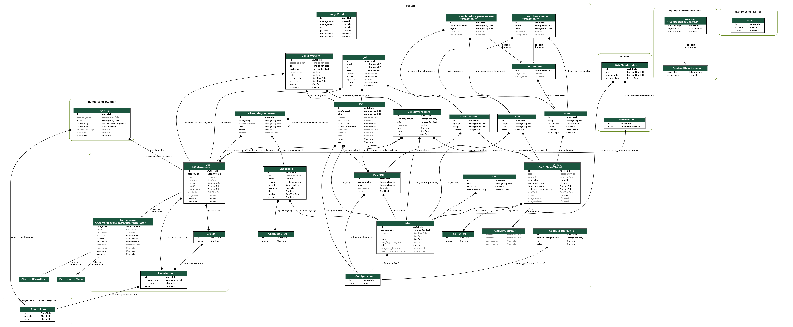

Introduction
============

This directory contains the OS2borgerPC Admin system, which is a remote
administration system for Debian-based GNU/Linux-systems, especially
Ubuntu systems.

The system was originally developed for public libraries in Denmark and
is specifically designed to manage their OS2borgerPC audience audience
desktop PCs.

By design, its functionality aims to be similar to that of Canonical's
Landscape product, but less ambitious. A special feature is security
alerts that may be triggered e.g. if a user changes a USB keyboard (some
libraries have experienced problems with people trying to insert key
loggers between keyboard and computer).

Read the documentation for this project in docs/ or at 
`Read The Docs <https://os2borgerpc-admin.readthedocs.io/>`_.

The system was prepared by Magenta: See http://www.magenta.dk

All code is made available under Version 3 of the GNU General Public
License - see the LICENSE file for details.

Models / Database visualized
============================

