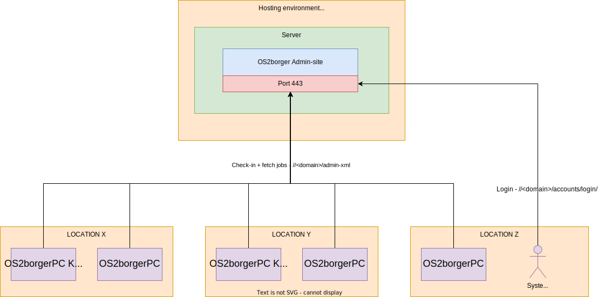
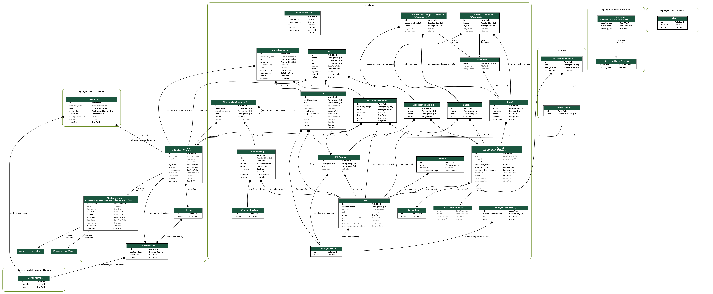

=======================
Technical Documentation
=======================

Architectural Diagram
---------------------

Terms
=====

* **Check-in:** During every 5 minute interval OS2borgerpc will attempt to connect to the Admin-site to 1. report in and 2. check if any *jobs* are pending. If so the os2borgerpc-client will download and execute these.
* **Job:** A *PC* or *Group* can be delegated 1..* jobs. A *job* is a set of instructions in the form of install- or configuration scripts written in bash or python.

|

Models / Database visualized
----------------------------

|

Hosting
-------

Configuring the use of customer admins
======================================

See the related
`Guide <https://github.com/OS2borgerPC/admin-site/raw/development/admin_site/static/docs/configuring_customer_admins.pdf>`_.
