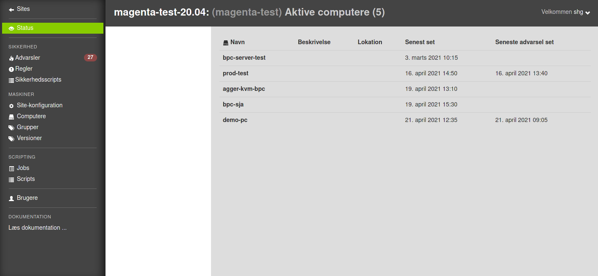

.. os2borgerpc-admin-site documentation master file, created by
   sphinx-quickstart on Wed May  5 13:17:51 2021.
   You can adapt this file completely to your liking, but it should at least
   contain the root `toctree` directive.

========================
OS2BorgerPC - Admin Site
========================

Introduction
============
This directory contains the OS2borgerPC Admin system, which is a remote
administration system for Debian-based GNU/Linux-systems, especially
Ubuntu systems.

The below figure shows a typical example of the user interface of the system:

.. toctree::
   :maxdepth: 2

   dev
   readme
   news

Indices and tables
==================

* :ref:`genindex`
* :ref:`modindex`
* :ref:`search`
